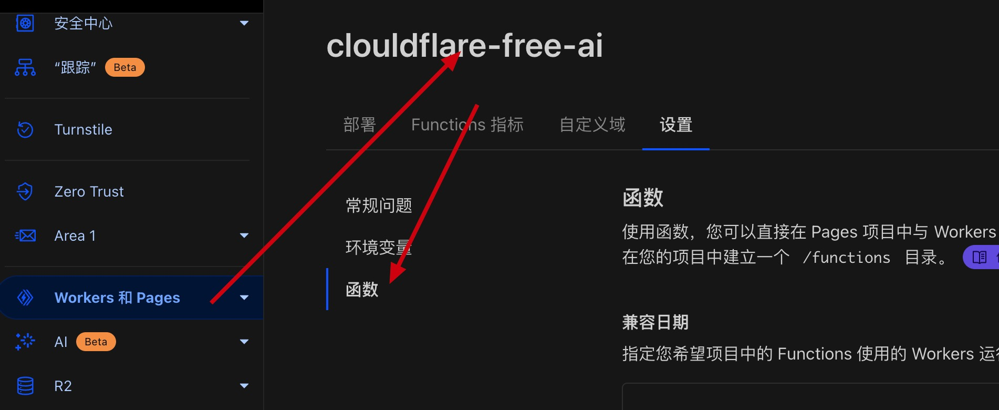

# clouldflare-free-ai

## 部署

``` bash
git clone <本仓库>
```

```bash
# 安装 wrangler
npm install -u -g wrangler
# 登录 cf
wrangler login
# pnpm i
pnpm i
# 部署, 部署过程中会提示输入一些 config
pnpm pages:deploy
```

部署完成后，打开 cloudflare 网站，找到你的 worker, 点击 function, 绑定 AI



